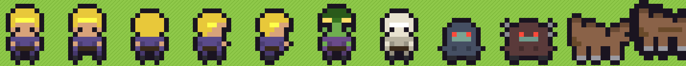

# ⚔️ LEONIS — Os Que Voltam

[]() []()

> *Épico ensolarado, nunca bobo. Tudo o que a humanidade tem, um Leonis trouxe.*

RPG-sandbox **2D pixel art top-down** de mundo aberto, inspirado em Cube World (referência original) e Forager (progressão), jogável no navegador. Um único mapa contínuo de **5.760 × 5.760 px sem loading**, com 10 zonas de nível 1 a 12 — **todas abertas desde o início**: dá pra ir direto ao final e morrer com estilo.



## ✨ O que tem no jogo

- **Sandbox aberto** — cidades, lugarejos, acampamentos da Corja, minérios, ervas e masmorras a céu aberto. O nível é do conteúdo; o aviso é seu.
- **Cidade do Berço (Porto-Canza)** — praça central, forja, estábulo, mercado de tendas, torres de vigia e dezenas de casas. **32+ NPCs nomeados** com retratos pixel e falas próprias (incluindo 9 ermitas que avisam o nível de cada zona).
- **6 raças × 12 armas** em 3 famílias (Guerra / Campo / Estranhas). Bumerangue que volta, serra que ricocheteia, corrente que puxa, flauta que acalma. Cada arma tem **10 tiers visuais** (madeira → prata → ouro → flame).
- **6 montarias**, cada uma com uma chave de domação diferente: missão, golpes pesados, carnes, chegar de barco, descobrir os Picos, sobreviver 60s no Umbigo. Fale com o **Domador Abero**.
- **Combate com leitura**: telegraph de inimigo, esquiva com i-frames e cooldown, 7 tipos de fera com peculiaridade (bando, arqueiro, bruto de área, investida, curandeiro, uivo que buffa, manso-que-fica-bravo) + elites.
- **Árvore de perícias estilo Forager**: 20 nós em 4 ramos (Guerra / Agilidade / Ofício / Vigor), +1 ponto por nível.
- **Loop de RPG**: minérios → forja (arma/couraça Nv.1-10) → zonas mais altas → minérios melhores. Baús de acampamento só abrem limpos.
- **Quests** com narrativa própria (a carga do comboio, o Ronceiro ferido), save/load (F5/F9), dia/ambiente sonoro procedural (WebAudio, zero assets de áudio).

## 🎮 Controles

| Tecla | Ação |
|---|---|
| `WASD` | mover · `Shift` correr/galopar |
| Mouse | mirar · **Esq.** ataque leve · **Dir.** pesado |
| `Espaço`/`C` | esquiva (i-frames, cooldown) |
| `E` | interagir / falar / embarcar / montar |
| `R` comer carne · `F` alimentar montaria · `Q` fúria (vínculo 4) |
| `Tab` | inventário · `K` árvore de perícias · `M` mapa |
| `F5`/`F9` | salvar / carregar · `ESC` pausa |
| `H` | ajuda |

## 🛠️ Como rodar

```bash
npm install
npm run dev        # http://localhost:5173
npm run build      # produção em dist/
```

Zero dependências de engine: **Canvas 2D puro + TypeScript + Vite** (~120 kB total). Pixel art 100% procedural em runtime (`src/pix.ts`) + atlas do autor (`public/img`).

## 📁 Arquitetura

```
src/
  main.ts       → boot
  game2d.ts     → loop, estados (título/intro/criação/jogo), combate, save
  world2d.ts    → geração do mundo, chunks, colisão, POIs, camps, fauna
  pix.ts        → fábrica de pixel art procedural (SPR registry, outline, shade)
  ui2d.ts       → HUD, painéis, título, criação, diálogos com retrato
  core.ts       → input mouse+teclado, áudio procedural, RNG, save
  data/defs.ts  → zonas, raças, armas, minérios, montarias, skills
docs/           → DEVLOG (diário de bordo), notas de sistemas
```

## 🗺️ Roadmap

- [x] M1 — protótipo voxel (arquivado em história do repo)
- [x] M2D — migração 2D: mundo aberto, combate, cidade, montarias, skills
- [ ] M3 — calabouços instanciados + chefes de zona
- [ ] M4 — mais biomas de montaria + criação
- [ ] M7 — empacotamento nativo (.exe)

## 📄 Créditos & licenças

- Fontes: [Press Start 2P](https://fonts.google.com/specimen/Press+Start+2P) e [VT323](https://fonts.google.com/specimen/VT323) — SIL OFL, bundladas em `public/fonts`.
- Ícones de armas e retratos: arte pixel fornecida pelo autor do projeto (`public/img`).
- Código, design e universo (Leonis / Bravo / Corja v2.2): autor do projeto.

*Quem sai, volta. Quem volta, volta trazendo.*
